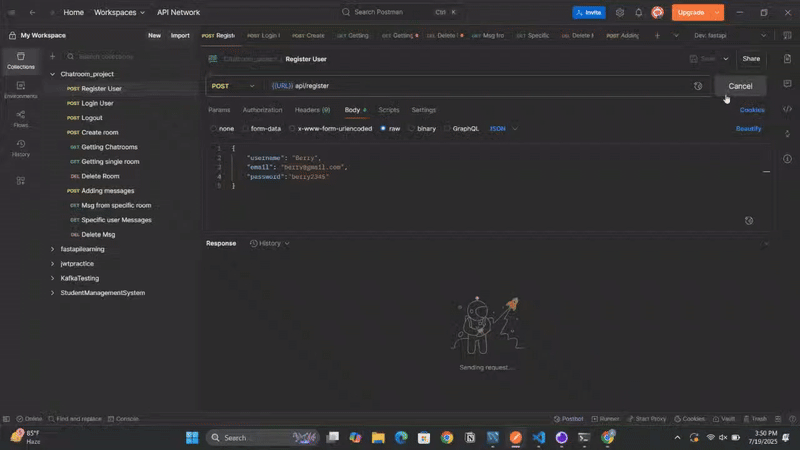

# FastAPI Chatroom Application

A real-time chatroom application built with **FastAPI**, **WebSockets**, **MySQL**, **Redis**, and **Docker**.  
It supports user authentication, chatroom creation, and real-time messaging using WebSockets.

---

## 🔧 Tech Stack

- FastAPI
- MySQL (via Docker)
- Redis (via Docker)
- SQLAlchemy + Alembic
- JWT Authentication
- Docker & Docker Compose

---


## Setup Instructions
## 📽️ Demo




##  Setup Instructions

### 1. Clone the repository

git clone https://github.com/AlizaNawaz-Dev/fastapi-chatroom.git
```bash
cd fastapi-chatroom
```
## 2. Docker Image

The Docker image for this project is available on Docker Hub:

[aleeza7/chatroom-app](https://hub.docker.com/r/aleeza7/chatroom-app)

Pull the image using:

```bash
docker pull aleeza7/chatroom-app
```
## 3. .env Example
```env
# DATABASE CONFIG 
DATABASE_HOSTNAME=localhost
DATABASE_PORT=3306
DATABASE_USERNAME=root
DATABASE_PASSWORD=password
DATABASE_NAME=yourdb

# REDIS CONFIG 
REDIS_HOST=localhost
REDIS_PORT=6379
REDIS_DB=0

# AUTH CONFIG
SECRET_KEY=your_secret_key
ALGORITHM=HS256
ACCESS_TOKEN_EXPIRE_MINUTES=30
```
